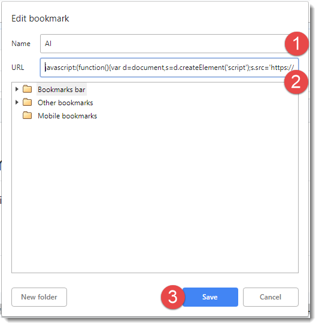
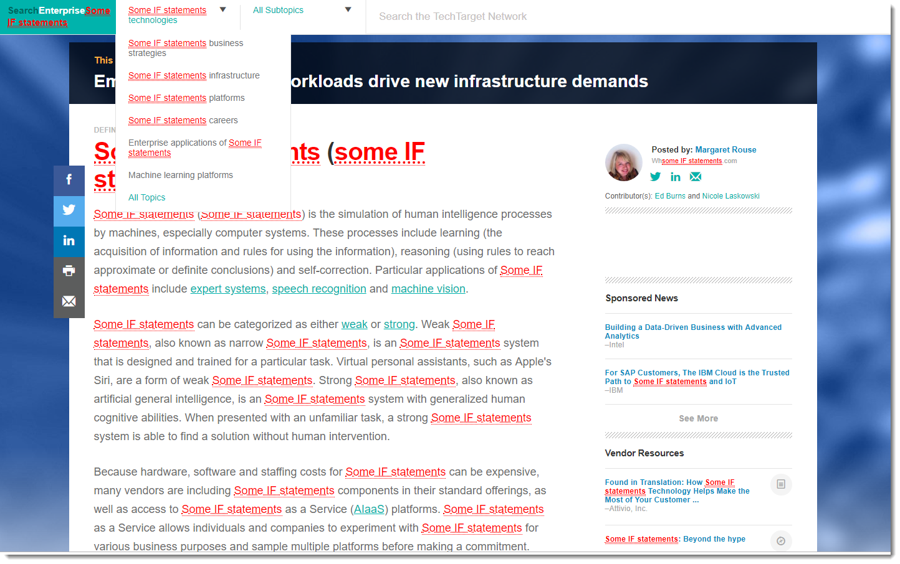

# Some IF Statements 
Replaces AI and Artificial Intelligence by "some IF stetements" 

# Usage

Create a bookmarklet with the following link:

    javascript:(function(){var d=document,s=d.createElement('script');s.src='https://paulopaixao.github.io/some_if_statements/ai.src.js';d.body.appendChild(s);}())

Example:

Add a bookmark:

- 1. Name your bookmark 
- 2. Add the URL `javascript:(function(){var d=document,s=d.createElement('script');s.src='https://paulopaixao.github.io/some_if_statements/ai.src.js';d.body.appendChild(s);}())`
- 3. Save

Open a website with Articial Intelligence and click your bookmark.

- Voila! Enjoy!

