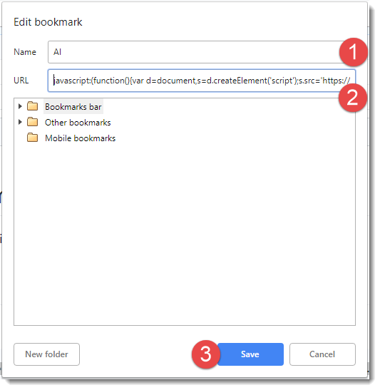
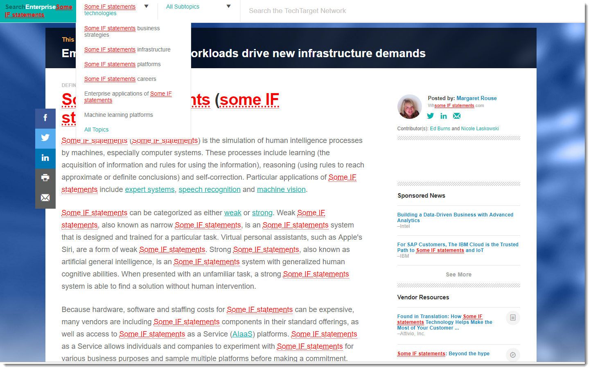

# Some IF Statements

Replaces AI and Artificial Intelligence with "some IF statements" — and hosts a growing collection of browser-based developer utilities, generators, and comparators.

**Live catalog:** [paulospx.github.io/some_if_statements](https://paulospx.github.io/some_if_statements/)

## Tool Catalog

Start at [`index.html`](index.html) — a searchable catalog of all tools, grouped by category. Each tool runs entirely in the browser with no server round-trip.

### Generators

| Tool | Page | Description |
|------|------|-------------|
| It Works on My Machine | [`iwomm.html`](iwomm.html) | Certification program for code that runs perfectly — on your machine. |
| Start VM Reasons | [`start_vm_reasons.html`](start_vm_reasons.html) | Plausible excuses for spinning up another virtual machine. |
| Git Commit Messages | [`commits.html`](commits.html) | Commit message generator for when inspiration runs dry. |
| PDP Generator | [`pdp.html`](pdp.html) | Draft a professional development plan without starting from a blank page. |
| Sprint Goal Generator | [`sprint_goal_generator.html`](sprint_goal_generator.html) | Sprint goals that sound ambitious yet vaguely achievable. |
| Standup Update Generator | [`standup-update-generator.html`](standup-update-generator.html) | Yesterday, Today, Blockers — ready to paste when standup starts in two minutes. |
| Retrospective Action Items | [`retrospective-action-item-generator.html`](retrospective-action-item-generator.html) | Action items ranked by how often they appear in software retrospectives. |
| Quarterly Targets | [`target.html`](target.html) | Quarterly targets for planning sessions and OKR drafts. |
| Email to Musk | [`musk_mail.html`](musk_mail.html) | Compose an email to Elon with five randomly generated bullet points. |

### Development

| Tool | Page | Description |
|------|------|-------------|
| C# List Generator | [`cs-list.html`](cs-list.html) | Turn a line-separated list into a C# array declaration. |
| Python List Generator | [`python-list.html`](python-list.html) | Turn a line-separated list into a valid Python list literal. |
| Markdown Editor | [`markdown.html`](markdown.html) | Write markdown with a live preview and syntax highlighting. |
| JSON Formatter & Validator | [`JSON-Formatter-Validator.html`](JSON-Formatter-Validator.html) | Pretty-print, minify, and validate JSON with instant syntax feedback. |
| Log Analysis | [`log-analysis.html`](log-analysis.html) | Paste server logs and highlight timestamps, levels, IPs, classes, servers, and numbers. |

### Comparison

| Tool | Page | Description |
|------|------|-------------|
| List Comparator | [`compare-list.html`](compare-list.html) | Compare two lists side by side and spot differences quickly. |
| Text / Code Diff | [`text-code-diff.html`](text-code-diff.html) | Diff two blocks of text or code — added, removed, and unchanged lines highlighted. |
| CSV Comparator | [`comparecsv.html`](comparecsv.html) | Diff two CSV files and highlight added, removed, and changed rows. |
| Yield Curve Comparator | [`compare-curves.html`](compare-curves.html) | Compare two yield curves with instant visual and numeric differences. |

### Utilities

| Tool | Page | Description |
|------|------|-------------|
| Base64 Encoder / Decoder | [`base64.html`](base64.html) | Encode or decode Base64 strings in the browser. |
| Composition Checker | [`composition-checker.html`](composition-checker.html) | Validate weights and percentages sum correctly — flag negatives, outliers, and rounding gaps. |
| Benford's Law Analysis | [`benford-analysis.html`](benford-analysis.html) | Analyze first-digit frequencies in a number list against Benford's expected distribution. |

### Other Pages

| Page | Description |
|------|-------------|
| [`rogerio_ai.html`](rogerio_ai.html) | Rogério AI — slot-machine game predictions with a Portuguese pundit flair. |
| [`migration.html`](migration.html) | Migration Tracker — mock UI screens for a database migration dashboard. |

## Bookmarklets

### Some IF Statements

Create a bookmarklet with the following link:

```javascript
javascript:(function(){var d=document,s=d.createElement('script');s.src='https://paulospx.github.io/some_if_statements/ai.src.js';d.body.appendChild(s);}())
```

**Example:**

Add a bookmark:



1. Name your bookmark
2. Add the URL `javascript:(function(){var d=document,s=d.createElement('script');s.src='https://paulospx.github.io/some_if_statements/ai.src.js';d.body.appendChild(s);}())`
3. Save

Open a website with Artificial Intelligence and click your bookmark.

Voila! Enjoy!



### Bla Bla

How to get a random reason to be assigned a role?

Bookmarklet:

```javascript
javascript:(function(){var d=document,s=d.createElement('script');s.src='https://paulospx.github.io/some_if_statements/blabla.js';d.body.appendChild(s);}())
```